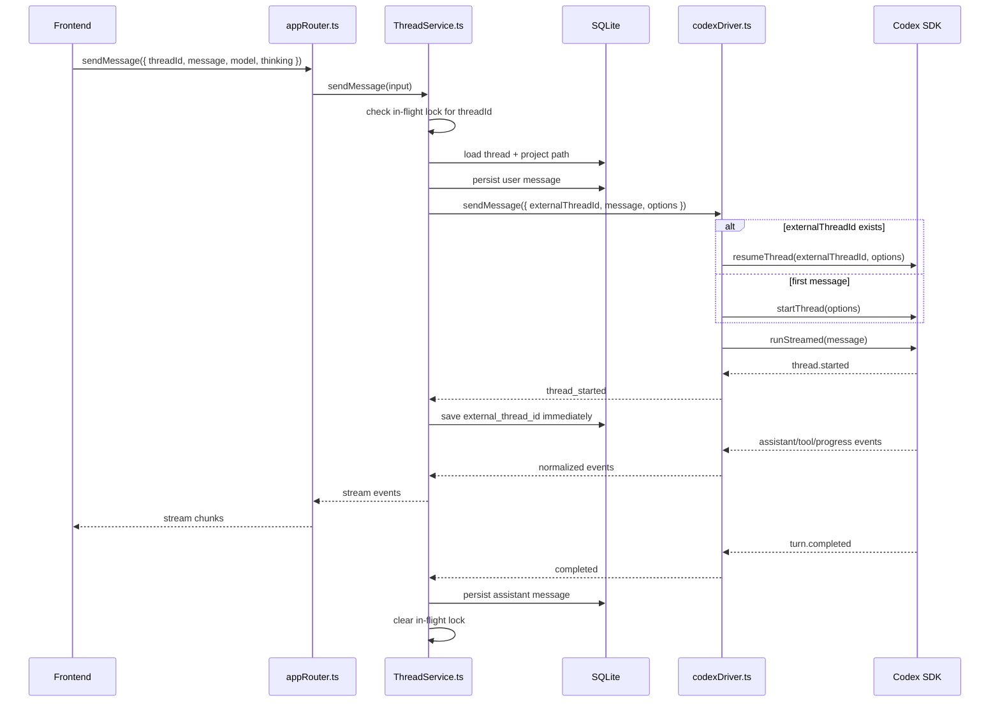

# Thread Service Architecture

## Summary

The server should use app-owned project and thread records while delegating model execution to harness drivers. Today the first driver is Codex, but the service boundary should make it straightforward to add other harnesses later.

The key idea is:

- The frontend knows the app `threadId`.
- SQLite maps that app `threadId` to project metadata, UI messages, and the external harness thread ID.
- `ThreadService` owns app-level orchestration, persistence, and concurrency.
- `codexDriver.ts` owns Codex-specific start, resume, and stream behavior.

## High-Level Architecture

```mermaid
flowchart TD
  Frontend["Frontend AI Window"] -->|sendMessage({ threadId, message, model, thinking })| Router["appRouter.ts"]

  Router --> Service["ThreadService.ts"]
  Service --> DB[("SQLite")]
  Service --> DriverInterface["AiDriver interface"]

  DriverInterface --> CodexDriver["codexDriver.ts"]
  CodexDriver --> CodexSDK["Codex SDK"]

  DB --> Projects["projects"]
  DB --> Threads["threads"]
  DB --> Messages["messages"]

  CodexSDK -->|stream events| CodexDriver
  CodexDriver -->|normalized driver events| Service
  Service -->|persist + stream| Router
  Router -->|stream chunks| Frontend
```

## File Responsibilities

### Keep `codexDriver.ts`

- Keep this file as the Codex harness adapter.
- It should own the shared `Codex` instance.
- It should know how to call `startThread`, `resumeThread`, and `runStreamed`.
- It should translate Codex SDK events into driver-level events that `ThreadService` can understand.
- It should hide Codex SDK types from the app-level service where practical.

### Add `aiDriver.ts`

- Define the common driver interface for future harnesses.
- Keep the interface small:
  - external thread ID in
  - message in
  - working directory and model options in
  - normalized stream events out
- This lets future drivers plug into `ThreadService` without rewriting persistence or frontend APIs.

### Add `threadService.ts`

- Own app-level chat orchestration.
- Load threads and projects from SQLite.
- Persist user and assistant messages.
- Persist the external harness thread ID.
- Own per-thread in-flight locks.
- Reject overlapping sends for the same app thread.
- Call the configured `AiDriver` instead of calling Codex directly.

### Refocus `lightProject.ts`

- Make it project CRUD only.
- Remove `Codex` creation.
- Remove `ThreadManager` ownership.
- Remove the local `projects` array if reads come from SQLite.

### Expand `lightDB.ts`

- Create `~/.lightcode` before opening the database.
- Use `path.join` for the database file path.
- Enable SQLite foreign keys with `PRAGMA foreign_keys = ON`.
- Create the `projects`, `threads`, and `messages` tables.

### Expand `lightQueries.ts`

- Keep project queries.
- Add thread queries:
  - create thread
  - get thread by ID with project path
  - get threads by project
  - update external thread ID
  - update thread timestamp
- Add message queries:
  - create message
  - get messages by thread

### Retire Or Delete `threadManager.ts`

- The current in-memory `threadList` should not be the source of truth.
- SQLite should own app thread metadata.
- Codex should own Codex conversation history.
- `ThreadService` replaces the useful orchestration role.

### Delete Or Keep `lightThread.ts` Only As A Private Helper

- The Codex SDK `Thread` object is already small.
- Prefer deleting `lightThread.ts` unless `codexDriver.ts` benefits from a tiny private helper.
- Do not let `lightThread.ts` own app thread selection or persistence.

## Database Schema

### `projects`

Stores project metadata and filesystem path.

```sql
CREATE TABLE IF NOT EXISTS projects (
  id TEXT PRIMARY KEY,
  project_name TEXT NOT NULL,
  path TEXT NOT NULL
);
```

### `threads`

Stores app-owned thread metadata and the external harness thread ID.

```sql
CREATE TABLE IF NOT EXISTS threads (
  id TEXT PRIMARY KEY,
  project_id TEXT NOT NULL,
  title TEXT NOT NULL,
  external_thread_id TEXT,
  driver TEXT NOT NULL DEFAULT 'codex',
  default_model TEXT,
  default_thinking TEXT,
  created_at TEXT NOT NULL DEFAULT CURRENT_TIMESTAMP,
  updated_at TEXT NOT NULL DEFAULT CURRENT_TIMESTAMP,
  FOREIGN KEY (project_id) REFERENCES projects(id) ON DELETE CASCADE
);
```

Notes:

- `external_thread_id` is Codex's `thread_id` for the Codex driver.
- The generic column name keeps the schema ready for future harnesses.
- If the code stays Codex-only for a while, naming this `codex_thread_id` is also acceptable.

### `messages`

Stores the UI-visible transcript.

```sql
CREATE TABLE IF NOT EXISTS messages (
  id TEXT PRIMARY KEY,
  thread_id TEXT NOT NULL,
  role TEXT NOT NULL CHECK (role IN ('user', 'assistant')),
  content TEXT NOT NULL,
  created_at TEXT NOT NULL DEFAULT CURRENT_TIMESTAMP,
  FOREIGN KEY (thread_id) REFERENCES threads(id) ON DELETE CASCADE
);
```

## Send-Message Flow



Steps:

- Frontend sends `{ threadId, message, model, thinking }`.
- `appRouter.ts` validates input and delegates to `ThreadService`.
- `ThreadService` rejects the send if the same thread already has a turn in progress.
- `ThreadService` loads the thread row and parent project path from SQLite.
- `ThreadService` persists the user message.
- `ThreadService` calls the configured `AiDriver`.
- `codexDriver.ts` starts a new Codex thread when `externalThreadId` is null.
- `codexDriver.ts` resumes the existing Codex thread when `externalThreadId` exists.
- When Codex emits `thread.started`, `ThreadService` saves the external thread ID immediately.
- Stream events are sent back to the frontend as they arrive.
- `ThreadService` accumulates assistant text and persists the assistant message when the turn completes.
- `ThreadService` clears the in-flight lock in a `finally` block.

## Pseudocode

### `AiDriver` Interface

```ts
export type DriverThreadOptions = {
  model: string;
  thinking: string;
  workingDirectory: string;
};

export type DriverSendInput = {
  externalThreadId: string | null;
  message: string;
  options: DriverThreadOptions;
};

export type DriverEvent =
  | {
      type: "thread_started";
      externalThreadId: string;
    }
  | {
      type: "assistant_text";
      text: string;
    }
  | {
      type: "raw_event";
      event: unknown;
    }
  | {
      type: "completed";
    }
  | {
      type: "failed";
      error: string;
    };

export interface AiDriver {
  sendMessage(input: DriverSendInput): AsyncGenerator<DriverEvent>;
}
```

### `CodexDriver`

```ts
import { Codex } from "@openai/codex-sdk";
import type { AiDriver, DriverEvent, DriverSendInput } from "./aiDriver.ts";

export class CodexDriver implements AiDriver {
  private codex = new Codex({
    config: {
      show_raw_agent_reasoning: true,
    },
  });

  async *sendMessage(input: DriverSendInput): AsyncGenerator<DriverEvent> {
    const options = {
      model: input.options.model,
      modelReasoningEffort: input.options.thinking,
      workingDirectory: input.options.workingDirectory,
    };

    const sdkThread = input.externalThreadId
      ? this.codex.resumeThread(input.externalThreadId, options)
      : this.codex.startThread(options);

    const { events } = await sdkThread.runStreamed(input.message);

    for await (const event of events) {
      if (event.type === "thread.started") {
        yield {
          type: "thread_started",
          externalThreadId: event.thread_id,
        };
      }

      if (
        event.type === "item.completed" &&
        event.item.type === "agent_message"
      ) {
        yield {
          type: "assistant_text",
          text: event.item.text,
        };
      }

      if (event.type === "turn.completed") {
        yield {
          type: "completed",
        };
      }

      if (event.type === "turn.failed" || event.type === "error") {
        yield {
          type: "failed",
          error:
            event.type === "turn.failed"
              ? event.error.message
              : event.message,
        };
      }

      yield {
        type: "raw_event",
        event,
      };
    }
  }
}
```

### `ThreadService`

```ts
import crypto from "node:crypto";
import type { AiDriver, DriverEvent } from "./aiDriver.ts";

export class ThreadService {
  private inFlight = new Map<string, true>();

  constructor(private driver: AiDriver) {}

  async *sendMessage(input: {
    threadId: string;
    message: string;
    model: string;
    thinking: string;
  }): AsyncGenerator<DriverEvent> {
    if (this.inFlight.has(input.threadId)) {
      throw new Error("Turn already in progress");
    }

    this.inFlight.set(input.threadId, true);

    try {
      const thread = getThreadWithProject.get(input.threadId);

      if (!thread) {
        throw new Error("Thread not found");
      }

      createMessage.run({
        id: crypto.randomUUID(),
        threadId: input.threadId,
        role: "user",
        content: input.message,
      });

      let assistantText = "";

      for await (const event of this.driver.sendMessage({
        externalThreadId: thread.external_thread_id,
        message: input.message,
        options: {
          model: input.model,
          thinking: input.thinking,
          workingDirectory: thread.project_path,
        },
      })) {
        if (event.type === "thread_started") {
          updateThreadExternalId.run(input.threadId, event.externalThreadId);
        }

        if (event.type === "assistant_text") {
          assistantText += event.text;
        }

        if (event.type === "completed") {
          if (assistantText.trim()) {
            createMessage.run({
              id: crypto.randomUUID(),
              threadId: input.threadId,
              role: "assistant",
              content: assistantText,
            });
          }

          updateThreadUpdatedAt.run(input.threadId);
        }

        if (event.type === "failed") {
          throw new Error(event.error);
        }

        yield event;
      }
    } finally {
      this.inFlight.delete(input.threadId);
    }
  }
}
```

## Resume Failure Policy

The Codex driver depends on local Codex session files. If an external thread ID becomes stale, the driver or service should handle that explicitly.

Recommended behavior:

- Try to resume when `external_thread_id` exists.
- If resume fails before a turn starts:
  - Clear `external_thread_id`.
  - Start a fresh external thread.
  - Keep local messages intact.
- If resume fails after a turn starts:
  - Surface the failure to the UI.
  - Do not silently create a second run.

## Assumptions

- `codexDriver.ts` remains because future harnesses are planned.
- `ThreadService` should not depend directly on Codex SDK types.
- SQLite stores app metadata and UI transcript.
- Codex stores model conversation history.
- Per-thread concurrency should initially reject overlapping sends.
- Queueing turns can be added later if the UX needs it.
